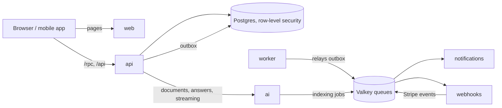

# Boilerplate

A full-stack product starter you can demo in an afternoon and still run in production a
year later: sign-up and sign-in (passwords with emailed verification codes, passkeys,
two-factor, Google), workspaces with roles and invitations, billing, notifications on
every channel, file uploads with virus scanning, an AI assistant over your documents, a
mobile app, a REST API with keys, and the infrastructure to ship all of it.

Everything is in the repo and off by default. The core profile starts in minutes on a
laptop; each optional feature switches on when its settings are present.

## Quickstart

You need Node 24 (`nvm use`), Bun 1.3, Docker, and uv for the AI service.

```sh
bun run setup     # once: .env with fresh secrets, dependencies, local services, migrations
bun dev           # web :3000, api :3001, worker :3002, notifications :3003, webhooks :3004
bun run db:seed   # optional: demo users, workspaces and data
```

Open http://localhost:3000 and sign up. Verification codes and every other email land
in Mailpit at http://localhost:58025. `bun dev:full` adds the AI service (:8000) and its
worker, file uploads (RustFS and ClamAV) and the rest; `bun run --cwd apps/mobile dev`
starts the mobile app. When something is off, `bun run doctor` says what and how to fix
it.

Local services run in Docker with small memory limits on their own ports (55432 for
Postgres, 56379 for Valkey, 5xxxx for the rest), so they sit beside other projects.
`bun run docker:clean` removes everything this repo created in Docker.

## What's inside

| Path | What |
|---|---|
| `apps/web` | Next.js, render-only: every read and write goes through the API |
| `apps/api` | NestJS on Fastify: auth (better-auth), the oRPC API for web and mobile, REST at `/api/v1` with an OpenAPI document, an MCP server |
| `apps/worker` | Outbox relay, audit log, file scanning, scheduled jobs |
| `apps/notifications` | Email, in-app, SMS and push, with preferences, digests and unsubscribe |
| `apps/webhooks` | Inbound provider webhooks (Stripe) and signed outbound webhooks for customers |
| `apps/ai` | Python: FastAPI, Pydantic AI, LangGraph, pgvector search, evals, an MCP server |
| `apps/mobile` | Expo (iOS, Android, web) on the same API client and translations |
| `packages/*` | Contracts, the API client and hooks, database, jobs, i18n, email templates, UI kit, shared Nest plumbing |
| `deploy/` | Container images, Helm charts, Argo CD, the local kind cluster |
| `infra/tofu` | OpenTofu for AWS, GCP and Azure (same outputs everywhere), Cloudflare in front |



Every tenant row is guarded by forced row-level security and each service connects as
its own least-privileged database role. Writes that other services react to go through
a transactional outbox, so nothing is lost between a commit and a queue.
[docs/architecture.md](docs/architecture.md) has the whole picture.

## Everyday commands

| Task | Command |
|---|---|
| Lint, formatting, boundaries, unused code | `bun run lint` (`bun run format` fixes) |
| Types | `bun run check-types` |
| Unit tests | `bun run test` |
| Integration tests (real Postgres, Valkey, Mailpit) | `bun run test:integration` |
| End-to-end (web, mobile, load smoke) | `bun run test:e2e` |
| Regenerate code after a schema or contract change | `bun run gen` |
| New migration | `bun run db:migrate` |
| Set a secret in `.env` | `bun run env:set KEY=value` |

[docs/testing.md](docs/testing.md) covers every test layer and what CI runs.

## Scaling path

Anything that changes as you grow sits behind one interface that every caller already
uses. Growing means writing a second implementation, not touching the callers. Each row
has a `swap-*` skill in `.claude/skills`.

| Concern | Now | Later | Where the interface is | Skill |
|---|---|---|---|---|
| Event transport | BullMQ on Valkey | Kafka, Redpanda, NATS JetStream | `apps/worker/src/outbox/event-bus.ts` | `swap-event-transport` |
| Outbox reading | polling with `SKIP LOCKED` and `LISTEN` | change data capture (logical replication) | `apps/worker/src/outbox/relay.service.ts` | `swap-outbox-source` |
| Read replicas | reads go to the primary | a replica behind `database.read` | `packages/db/src/client.ts` | `swap-read-replicas` |
| Object storage | S3 API (RustFS, R2, S3, GCS) | any provider, S3 API or not | `packages/nest-common/src/storage.ts` | `swap-storage` |
| File scanning | ClamAV | a scanning service | `apps/worker/src/files/file-scanner.ts` | `swap-file-scanner` |
| Email | SMTP to our Stalwart mail server (Mailpit locally) | any SMTP server, or a provider API | `apps/notifications/src/channels/email/email-transport.ts` | `swap-email-provider` |
| SMS | Twilio | another provider | `apps/notifications/src/channels/sms/sms-transport.ts` | `swap-sms-provider` |
| Push | FCM, APNs, Web Push | OneSignal and the like | `apps/notifications/src/channels/push/push-transport.ts` | `swap-push-provider` |
| Notification templates | in code | a database, edited without a deploy | `apps/notifications/src/dispatch/templates.ts` | `swap-notification-templates` |
| Translations | JSON bundled in `packages/i18n` | a database plus Redis cache | `packages/nest-common/src/i18n.ts` | `swap-translations` |
| Encryption keys | `ENCRYPTION_KEYS` from the secret manager | a KMS unwrapping data keys | `packages/nest-common/src/crypto.ts` | `swap-secrets-encryption` |
| Realtime fan-out | pub/sub on the shared Valkey | a dedicated Redis or NATS | `packages/nest-common/src/realtime.ts` | `swap-realtime` |
| LLM access | providers called directly, with a fallback model | a gateway (LiteLLM, a router) | `apps/ai/app/assistant.py` | `swap-llm` |
| Embeddings | provider models, or hashing locally | any embedding model | `apps/ai/app/embeddings.py` | `swap-embeddings` |
| Vector search | pgvector | Qdrant or another vector store | `PassageSearch` in `apps/ai/app/assistant.py` | `swap-document-search` |

Some growth steps don't need an interface, because they're configuration or a move:
Valkey becomes a managed cluster through `REDIS_URL`; auth (better-auth in
`apps/api/src/auth`) can move to its own service or an external identity provider, since
clients only talk to `/api/auth` on the site's origin; a very large tenant can get its
own database, as every query already runs inside a tenant context; traces and metrics go
to any OpenTelemetry collector once `OTEL_EXPORTER_OTLP_ENDPOINT` is set
(`packages/nest-common/src/telemetry.ts`, `apps/ai/app/telemetry.py`). There is no
search feature yet (start with Postgres full-text search).

## Shipping

Every merge to `master` builds signed, attested images for amd64 and arm64 and deploys
them to staging. release-please keeps a release pull request open; merging it tags a
version and opens a promotion pull request that points production at it. Labelled pull
requests get a preview environment of their own. See [docs/deploy.md](docs/deploy.md),
[deploy/README.md](deploy/README.md), [infra/tofu/README.md](infra/tofu/README.md) and,
for the one-time GitHub setup, [docs/repository-settings.md](docs/repository-settings.md).

## Working with Claude Code

The repo is set up for Claude Code: `CLAUDE.md` and path-scoped rules, skills for every
lifecycle task (setup, dev, add a feature, change the database, deploy, release, roll
back, swap a seam), review agents, and hooks that format on edit, guard generated files
and secrets, and run the affected tests before a turn ends.

## Contributing and license

See [CONTRIBUTING.md](CONTRIBUTING.md) and [SECURITY.md](SECURITY.md). The code is
published for viewing only; all rights reserved (see [LICENSE](LICENSE)).
