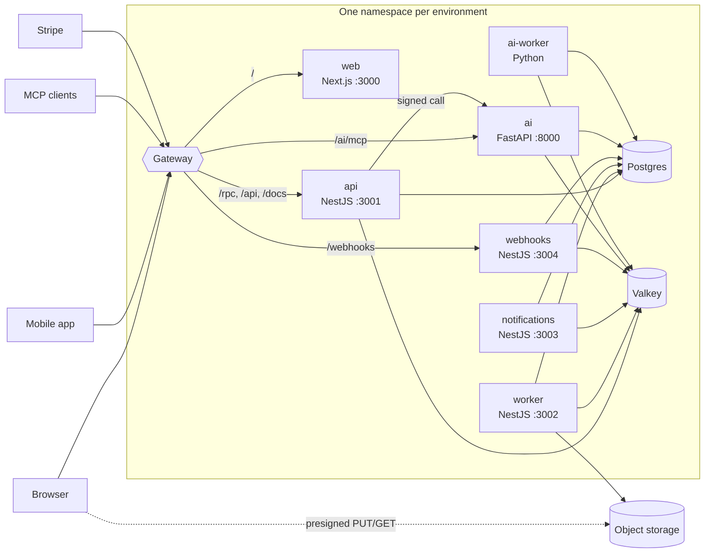

# Architecture

## Deployables

| Service | Does | Talks to |
|---|---|---|
| `apps/web` | renders the UI; no backend code | the API, on the same origin |
| `apps/api` | auth (better-auth), the oRPC API (`/rpc`, `/api/v1`), the MCP server for todos, billing | Postgres, Valkey, the AI service, Stripe, object storage (presigning) |
| `apps/worker` | the outbox relay, audit log, upload checks, realtime nudges, scheduled housekeeping | Postgres, Valkey, object storage, ClamAV |
| `apps/notifications` | every email, in-app notification, push and text | Postgres, Valkey, email/SMS/push providers |
| `apps/webhooks` | inbound provider webhooks (Stripe), outbound customer webhooks | Postgres, Valkey, customer endpoints |
| `apps/ai` + `ai-worker` | documents, retrieval, the assistant, summaries, the MCP server for documents | Postgres (pgvector), Valkey, model providers, the API's JWKS |
| `apps/mobile` | the Expo app | the API, on the site's origin |

Services never import each other (`lint:boundaries`, rule `no-app-imports-app`). They
share `packages/*` and talk through the API contract, queues and events. The only direct
service-to-service call is the API calling the AI service, with a typed client and a
token it signs per call.

Locally the gateway's job is done by `next.config.ts` rewrites (`/rpc`, `/api`, `/docs`,
the OAuth discovery documents and `/ai/mcp`), so the browser sees one origin in both
setups. Inbound Stripe webhooks go straight to `localhost:3004/webhooks/stripe`.

## A request

1. The browser calls `/rpc/<procedure>` on the site's origin (web and mobile use the
   oRPC protocol through `packages/client`); third parties call the same procedures over
   REST at `/api/v1/...`, described by `/api/v1/openapi.json` (interactive reference at
   `/docs` outside production).
2. The gateway routes it to apps/api. Fastify resolves the client IP through
   `TRUSTED_PROXIES`, and every request runs in a request context (request id, locale,
   client version) that logs, queued jobs and outbox events inherit. Logs and traces keep
   a URL's path and its query's parameter names, never their values (OAuth codes and
   tokens travel there). Both protocols take
   JSON bodies only, of at most 1 MB, checked before anything else runs (anything else
   is a 415 or 413); files go to object storage directly, through presigned URLs.
3. The procedure pipeline (`apps/api/src/rpc/procedures.ts`) is the only one: version
   gate, session or API key, membership in the active organization, role, the rate limit
   the contract declares, and error mapping, identical for RPC and REST. Input is
   validated by the contract's zod schema. Only the endpoints listed as public in
   `apps/api/src/rpc/router.test.ts` answer without a session; the test calls every
   procedure signed out to prove it.
4. The feature module (`apps/api/src/modules/<feature>`: router, service, repository)
   queries through `withTenant` / `tenantTx`, so Postgres row-level security scopes it to
   the organization, and writes its domain events to the outbox in the same transaction.
   Only the repository touches Prisma; the service owns the transaction and hands its
   `Tx` to the repository (`lint:boundaries` checks this).
5. Errors leave as stable codes (`packages/contracts/src/errors.ts`) with parameters;
   clients translate `errors.<code>` themselves. Every HTTP surface answers an error in
   the same JSON body, oRPC's: `{ code, status, message, data: { params, requestId,
   issues? } }`, with the catalog's status. Procedures produce it; for the rest (a
   malformed or oversized body, the wrong media type, an unknown route, raw routes such
   as file downloads and inbound webhooks) `createServer` installs a filter and raw
   routes call `sendError` (`packages/nest-common/src/http-errors.ts`). better-auth's
   errors get the same envelope with their own codes, and OAuth's errors keep RFC
   6749's. The Python service's body is generated from the same schema. It's
   `application/json`, not RFC 9457's `application/problem+json`: one shape over RPC,
   REST and auth matters more here than the standard's field names.

Other routes on the API: `/api/auth/*` (better-auth), `/api/mcp` (MCP),
`/api/v1/files/<id>/content` (redirect to a signed download),
`/api/v1/notifications/unsubscribe` (one-click unsubscribe), `/health/live`,
`/health/ready` and `/health/dependencies` (every backend service has these; the web
app's probe is `/healthz`). Readiness means the process serves requests; the dependency
check, which fails while Postgres or Redis don't answer, is for dashboards and start-up
scripts, so a shared dependency's restart doesn't take every pod out of rotation.

## Auth and tenancy

better-auth in apps/api: email and password with emailed codes, passkeys, Google, TOTP,
server-side sessions in Redis with a Postgres copy, organizations with owner, admin and
member roles, workspace API keys with scopes, and an OAuth 2.1 server for MCP clients.
See [auth.md](auth.md).

The tenant is the organization ("workspace"). Every user gets a personal one at sign-up;
a session has one active organization, and the API re-checks membership on every call.
Tenant tables carry `org_id` (or `user_id` for per-user data) and forced row-level
security keyed on a transaction-local setting, so a query without it sees nothing, in
every service and in Python too. See [database.md](database.md).

## Async work

A change and its event commit together (transactional outbox); the worker's relay copies
events into one BullMQ queue per consumer (audit, webhooks, notifications, billing,
realtime), and every consumer is idempotent. Work that can be re-created (emails, upload
checks, indexing) goes straight to typed queues. Live UI updates are Redis pub/sub
nudges streamed to clients over `/rpc`. See [jobs-and-events.md](jobs-and-events.md).

## Where things live

| Concern | Where |
|---|---|
| API contract, input schemas, limits, error codes | `packages/contracts/src/api`, `errors.ts` |
| Request pipeline (auth, tenancy, errors) | `apps/api/src/rpc/procedures.ts` |
| Auth configuration | `apps/api/src/auth/auth.ts` |
| Optional features and their switches | `apps/api/src/features.ts`, each service's `src/env.ts` |
| Schema, migrations, tenancy helpers, test databases | `packages/db` |
| Queues, job payloads, event routing | `packages/jobs/src/queues.ts` |
| Domain events | `packages/contracts/src/events.ts` |
| Outbox writer | `packages/nest-common/src/outbox.ts` |
| Shared Nest plumbing (bootstrap, env fragments, db, Redis, logging, health, rate limits, storage, crypto) | `packages/nest-common` |
| Client hooks for web and mobile | `packages/client` |
| Every user-facing string | `packages/i18n` |
| Email templates | `packages/email` |
| Web components and design tokens | `packages/ui` |
| Python service | `apps/ai` ([python-services.md](python-services.md)) |
| Deploy: images, charts, GitOps, infra | `docker-bake.hcl`, `deploy/`, `infra/tofu` ([deploy.md](deploy.md)) |

## Seams

Integrations that will change at scale sit behind one interface that callers already
use; each interface's file says how to swap it. The full list, with what each becomes
and the skill that swaps it, is the "Scaling path" table in the [README](../README.md#scaling-path).

## Glossary

| Term | Means here |
|---|---|
| Workspace, organization | the same thing: the tenant. The UI says workspace; the code, better-auth and the database say organization (`org_id`). Every user gets a personal one at sign-up |
| Tenant table | a table with `org_id` (or `user_id` for per-user data) and forced row-level security, read through `withTenant` and written in `tenantTx` ([database.md](database.md)) |
| Owner schema | each Postgres schema (`app`, `auth`, `files`, …) has one service that writes it; others get the narrowest grants they need ([database.md](database.md#schemas-and-owners)) |
| Runtime role, migrator | services connect as their own `app_<service>` role, which can't change the schema or bypass row-level security; migrations run as `migrator`, which owns every table |
| Outbox | a table each event-emitting service writes its domain events to, in the same transaction as the change; the worker's relay copies them into the queues ([jobs-and-events.md](jobs-and-events.md)) |
| Domain event | a versioned fact (`todo.completed.v1`) published through the outbox; the audit log, customer webhooks, notifications, billing and live updates consume them |
| Seam | an interface every caller goes through for something that changes at scale (email, storage, event transport, …), so growing means a new implementation, not new callers. The README's "Scaling path" lists them, each with a `swap-*` runbook |
| Feature switch | an optional feature is on only when its variables are set (`apps/api/src/features.ts`); off, its procedures answer `FEATURE_DISABLED` and clients hide it |
| Stand-in | a local replacement for a third party that speaks its real protocol: Mailpit for email and texts, `packages/fake-stripe`, the fake push and Twilio servers, the `local:extractive` model and `hashing` embeddings. Production refuses them at boot |
| Profile | a set of local Docker services: core (`bun run db:up`), `mail`, `full` ([troubleshooting.md](troubleshooting.md#local-services)) |
| Staging bump | the commit deploy.yml pushes to `master` after a merge, setting staging's image tag; it's how staging deploys |
| Promotion pull request | the pull request `bun run promote v<version>` opens to point production at a release's images; merging it is the production deploy ([deploy.md](deploy.md)) |
| Preview | a pull request's own environment, in namespace `pr-<number>`, while it carries the `preview` label |
